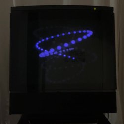
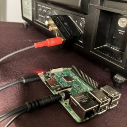

# Shanat

_Simple, zero-dependency shader sketch for the Raspberry Pi 3B's composite video output_

 

### Building and running

To build, run `build.sh` from the root. The executable is `bin/shanat`.

### Code structure

In the C++ code, all the low-level code related to EGL, GBM and DRM (don't even ask me what all that shit is) is tucked away in `horrors.h` and `horrors.cpp`. The code in `main.cpp` is a render loop where only the OpenGL calls remain. That's not pretty either, but it's relatively little, and it's the same old ugliness you find in WebGL.

The specific sketch with the balls dancing around the Lissajous curve is under `/lissaj`. I'm calling `shaders_incldes.sh` as a "pre-build step" so the shaders can live in their own files with a GLSL extension. The step puts them into string literals inside `shaders.h`.

`geo` and `fps` contain utilities for vector math and frame rate management. They do reinvent the wheel, but this way the sketch has no dependencies.

`webgl-proto-lissaj` is not strictly part of this sketch. It is its own thing where I prototyped the animation in WebGL+Javascript.

### Environment

I've built this specifically for the Raspberry Pi 3B. I'm running the latest stable OS as of September 2025, which is based on Debian Bookworm. They've changed around a lot of things realated to display management over the last few versions, so YMMV.

I installed the OS's headless, "light" version, so there is no graphical UI. I'm connecting over SSH.

- In `/boot/firmware/config.txt`, you need to use KMS (not the earlier "fake" thing called FKMS) with the following line:  
 `dtoverlay=vc4-kms-v3d,composite`
- In `/boot/firmware/cmdline.txt` add `vc4.tv_norm=PAL video=HDMI-A-1:720x576@50M`

I have nothing plugged into HDMI. If you want composite out **and** HDMI, you'll probably need to play around with `hdmi_force_hotplug` and `hdmi_ignore_hotplug` in `config.txt`.

### Prerequisites

The code is dependency-free in that it uses no frameworks or graphics libraries. However, it does need the system modules installed in order to access the GPU (Broadcom VideoCore IV). In my headless setup that meant manually installing these packages:

```
sudo apt install -y \
    build-essential git cmake pkg-config \
    libegl1-mesa-dev libsdl2-dev libgles2-mesa-dev \
    libdrm-dev libgbm-dev
```

Not needed to build, but these are also useful to have around:

```
sudo apt install -y \
    xvfb mesa-utils libdrm-tests
```

When looking around for the available displays, these two commands were my best friend:

```
ls -l /dev/dri/
sudo modetest -D /dev/dri/card0
```

In modetest's output, you want to look for connectors like those below. They are buried in a lot of noise. What I needed for the composite output was Composite-1 to show up. This info might help you figure out your own setup.

```
id	encoder	status		name		size (mm)	modes	encoders
33	0	disconnected	HDMI-A-1       	0x0		0	32
51	50	unknown         Composite-1    	0x0		4	50
```


